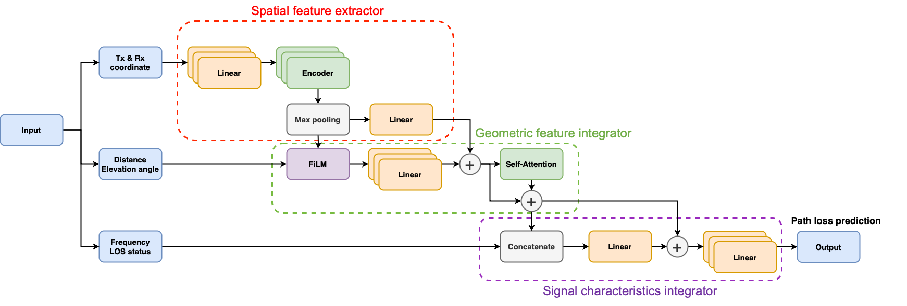

GeoSigNet
===

## **Model architecture**



## Usage
**Train**
```bash
python train.py --model_name GeoSigNet --dataset 3GPP_scenario_100k.csv --tag 100k_with_all_sensor --batch_size 512 --add_columns Distance,Angle,LOS_Flag,GPS --warmup_factor 10 --warmup_epochs 10
```


**Test**
```bash 
python batch_test.py --model_name GeoSigNet --model_folder GeoSigNet/30m_with_all_sensor_epoch100 --dataset 3GPP_scenario_100k.csv --tag 30m_with_all_sensor  --add_columns Distance,Angle,LOS_Flag,GPS
```

Data Preparation
The training data is generated using the `ray_tracing_generate.ipynb` notebook.
Important: The raw data generated by the notebook requires conversion to a format suitable for the model input. 


---
citation
