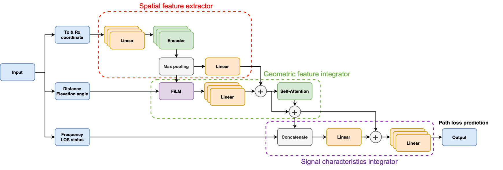

無人機空對地訊號強度預測模型
===

## **Model architecture**



## Usage
**Train**
```bash
python train.py --model_name GeoSigNet --dataset 3GPP_scenario_train_100k.csv --tag 100k_with_all_sensor --batch_size 512 --add_columns Distance,Angle,LOS_Flag,GPS --warmup_factor 50 --warmup_epochs 20
```


**Test**
```bash 
python batch_test.py --model_name GeoSigNet --model_folder GeoSigNet/100k_with_all_sensor_epoch100 --dataset 3GPP_scenario_test_10k.csv --tag 100k_with_all_sensor  --add_columns Distance,Angle,LOS_Flag,GPS
```

補充說明：
- 資料集總共有12個欄位，包括Tx_x, Tx_y, Tx_z, Rx_x, Rx_y, Rx_z, Distance, Angle, Frequency_GHz, LOS_Flag, Path_loss, 3GPP_Path_Loss
    - 訓練+驗證資料集：`3GPP_scenario_train_100k.csv`
    - 測試資料集：`3GPP_scenario_test_10k.csv`
- 使用GPU：RTX4090
    - 模型訓練之記憶體使用量：814MiB
    - 模型佔用空間：44MB
    - 模型訓練結果輸出類型：Float number
    - 模型推理速度：每個Batch(1024筆資料)約0.003秒